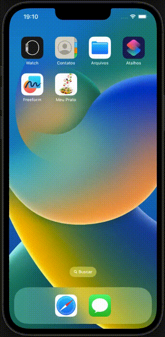
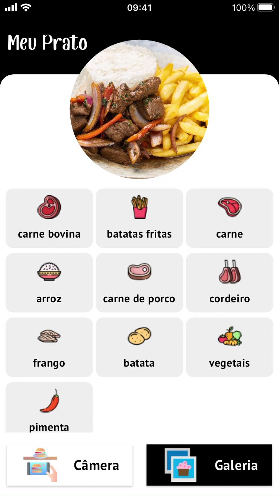
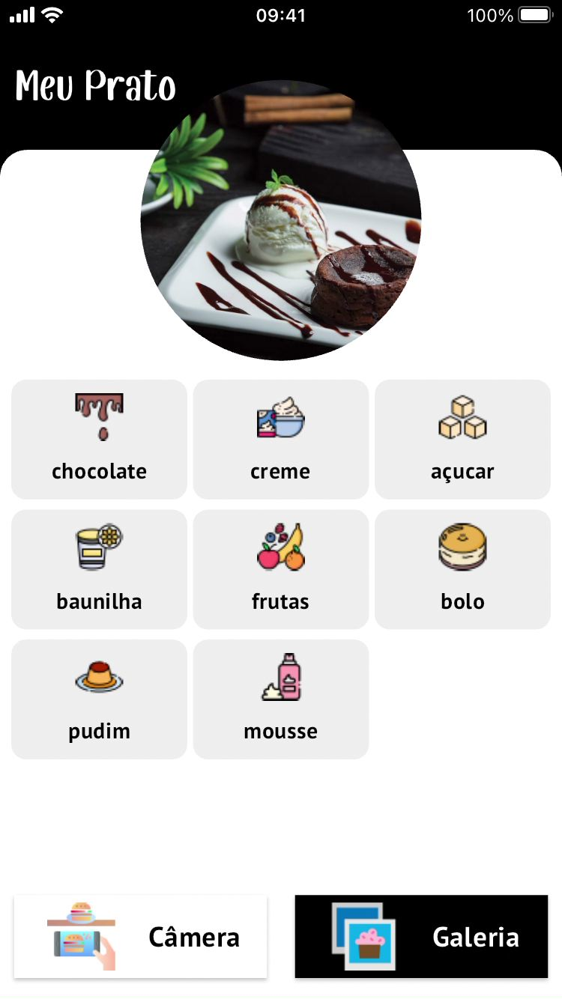
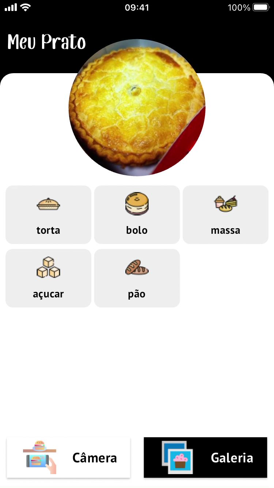
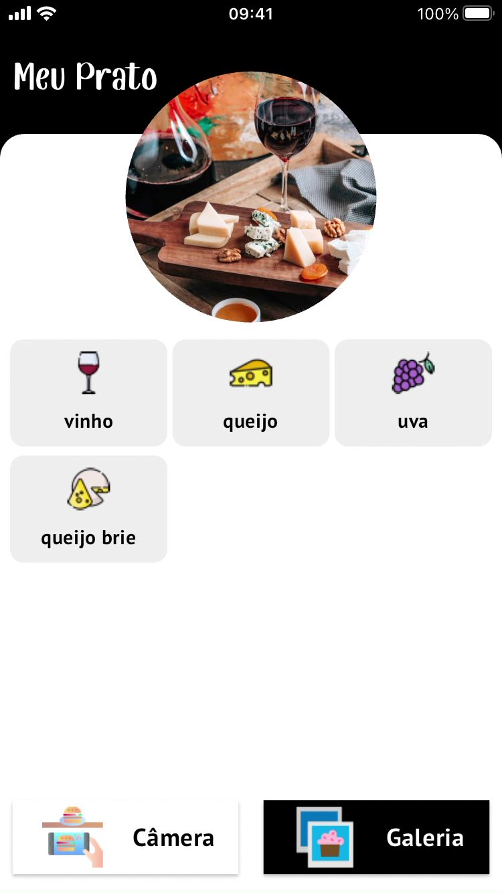
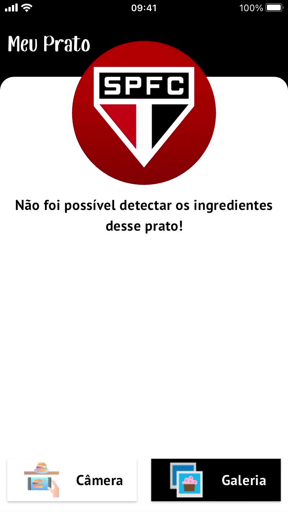
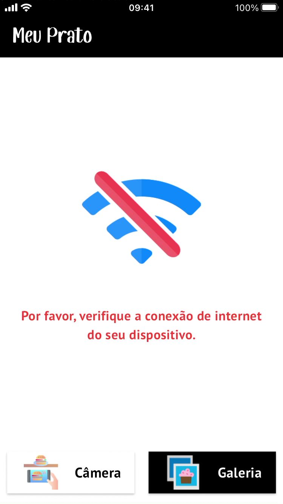
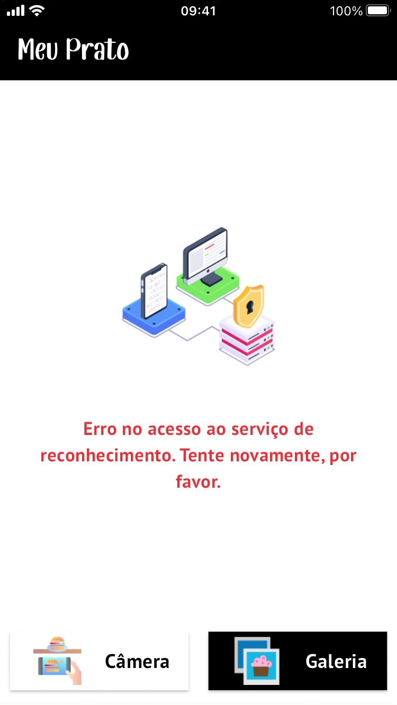
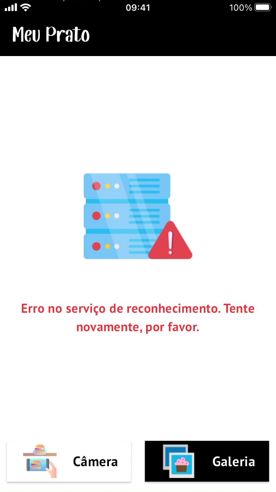
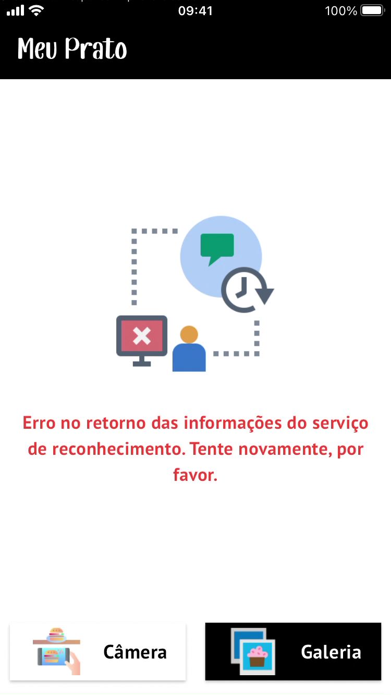

# Meu Prato - Usando inteligência artificial para o reconhecimento dos ingredientes de um prato.

Reconhecer automaticamente os componentes de uma imagem é uma das grandes questões da área da inteligência artificial. 

Talvez o principal desafio seja na área médica, a descoberta de uma possível doença, sua gravidade e especificidade, onde o olho humano não consegue alcançar em um primeiro momento, possibilitando assim seu tratamento prévio.

Na esfera policial, modificar a imagem de uma criança desaparecida há alguns anos, por exemplo, aproximando-se da forma mais fiel possível de sua aparência atual, restabelecendo a esperança de seus familiares.

Reconhecer e restaurar uma imagem antiga, ou até mesmo uma foto, chegando ao ponto de adicionar cores onde originalmente é preto e branco, aproximando-se o máximo de seu retrospecto real.

Esses são apenas alguns exemplos de muitos outros existentes. Nesse projeto, o objetivo é, dada a imagem de um alimento, reconhecer os seus possíveis componentes ou ingredientes, utilizando o serviço do [Clarifai](https://www.clarifai.com).

## Tecnologias/bibliotecas

Algumas das tecnologias/bibliotecas utilizadas na construção do aplicativo foram:

 - Flutter toolkit 3.13.3 (stable)
 - Dart 3.1.1
 - flutter_modular ^6.0.4+1
 - asp: ^1.3.0
 - result_dart: ^1.1.0
 - uno: ^1.1.9
 - uuid: ^3.0.7
 - connectivity_plus: ^4.0.2
 - equatable: ^2.0.5
 - flutter_dotenv: ^5.1.0
 - image_picker: ^1.0.2
 - kt_dart: ^1.1.0
 - path_provider: ^2.1.0
 - shimmer: ^3.0.0
 - lint ^2.1.2
 - mocktail ^1.0.0
 - icons_launcher: ^2.1.4
 - flutter_native_splash: ^2.3.3

Além dessas, há também outras bibliotecas. O pubspec.yaml possui a lista completa das bibliotecas utilizadas.

## Clarifai

Fundada em 2013, [Clarifai](https://www.clarifai.com) é uma plataforma de soluções de softwares baseadas em inteligência artificial. Dentre as soluções disponíveis estão: <b>reconhecimento de imagens</b>, para identificação de objetos, incluindo até mesmo se há conteúdo inadequado (drogas, violência, etc...), <b>detecção de imagens</b> (reconhecimento de uma localidade, por exemplo), <b>detecção de logos conhecidos</b>, <b>detecção de idiomas</b>, incluindo palavras e textos obcenos, além de outras soluções.

Para esse projeto, a solução utilizada foi o <b>reconhecimento de imagens</b>. Para mais detalhes, consulte esse [link](https://clarifai.com/clarifai/main/models/general-image-recognition?tab=versions).

Para utilizar o serviço do Clarifai, é necessário criar uma conta. Essa conta pode ser cadastrada na própria plataforma, ou utilizando os serviços de usuários do google ou do github.

Por fim, o Clarifai possui 3 planos: o <b>Community</b>, que é o plano gratuito e limitado, o <b>Essential</b> e o <b>Professional</b>, ambos pagos, sendo o Professional o mais caro, porém, voltado para um grande volume de dados.

O serviço utilizado foi o <b>Community</b>, pois o aplicativo gerado por enquanto não estará disponível publicamente na Apple Store e Google Play.

### Configurando um projeto no Clarifai

Para usar o serviço do Clarifai, é necessário cadastrar um projeto e gerar a sua chave de acesso. Além disso, é necessário escolher qual o modelo de treinamento a ser utilizado. Há duas opções: [General](https://clarifai.com/clarifai/main/models/general-image-recognition) e [Food](https://clarifai.com/clarifai/main/models/food-item-recognition). Dentro da documentação de cada modelo há um tutorial de uso, tanto baseado em alguma api já criada, de acordo com a linguagem ou plataforma (Python, Javascript, Java, NodeJS, cURL, PHP), como acessado diretamente a url, através de algum cliente http.

Esse projeto acessou diretamente a url, utilizando a biblioteca [uno](https://pub.dev/packages/uno), desenvolvido pela [flutterando](https://flutterando.com.br).

Apesar do modelo Food ser altamente sugestivo para esse projeto, notou-se uma maior discrepância em relação ao modelo General. Em resumo, o modelo Food encontra mais ingredientes em uma imagem, entretanto, muitos não correspondentes. São os chamados <b>falsos positivos</b>. Por outro lado, o modelo General encontra menos ingredientes, mas em geral o resultado final é muito mais próximo ao esperado. Optou-se, então, pelo uso do modelo <b>General</b>.

### Configurando as chaves de acesso do Clarifai

Obviamente, as chaves privadas de acesso ao Clarifai não estão disponíveis no repositório. No diretório <b>flutter_food_recognition_clarifai</b>, há um arquivo chamado <b>.env_example</b>. Esse arquivo contém todos os campos necessários para a configuração de acesso ao Clarifai, mas sem os seus dados privados. 

<b>Esse arquivo precisa ser transformado em um arquivo chamado <b>.env</b>, seja através de uma cópia ou renomeando-o diretamente</b>.

O arquivo contém os seguintes campos:

```
CLARIFAI_BASE_URL=https://api.clarifai.com
CLARIFAI_MODEL_URL=v2/models
CLARIFAI_API_MODEL_ID=general-image-recognition/versions
CLARIFAI_API_MODEL_VERSION_ID=aa7f35c01e0642fda5cf400f543e7c40
CLARIFAI_USER_ID=               // Usuário cadastrado na plataforma do Clarifai
CLARIFAI_PROJECT_NAME=          // Nome do projeto criado na plataforma do Clarifai
CLARIFAI_PROJECT_ID=            // ID do projeto criado na plataforma do Clarifai
```

Ao configurar esse arquivo com os dados corretos, a aplicação automaticamente irá montar a url, os headers e o body necessários para o acesso ao serviço do Clarifai.

## O projeto

### Estrutura

O projeto está dividido em 5 subprojetos:

 - <b>flutter_food_recognition_dependency_module</b>: responsável pelo cadastro e disponibilidade das bibliotecas que serão usadas por todos os outros subprojetos.

 - <b>flutter_food_recognition_core</b>: responsável pelas classes de interface a serem implementadas ao longo dos subprojetos. Implementações independentes de contextos, como, por exemplo, verificação da disponibilidade de internet, também localizam-se nesse subprojeto.

 - <b>flutter_food_recognition_clarifai</b>: classes de interface e implementações voltadas ao Clarifai, como, por exemplo, o arquivo .env com as credenciais de acesso e a classe de leitura desse arquivo, configuração da url, headers e body necessários para acessar o serviço, além do <b>DTO</b> (<i>Data Transfer Object</i>) para leitura dos resultados obtidos, transferindo-os ao domínio.
 
 - <b>flutter_food_recognition</b>: resumidamente é o domínio do reconhecimento de imagens, seus <i>value objects</i> e o <i>repository</i> para a consulta do serviço do Clarifai ou de qualquer outro que possa ser utilizado futuramente. É o <i>value object</i> o responsável por verificar se um termo ou ingrediente retornado na lingua inglesa possui a sua tradução para o português, retirando-o do resultado final em caso negativo.

 - <b>flutter_food_recognition_app</b>: responsável pela construção (<i>build</i>) do aplicativo propriamente dito. É onde está o arquivo <i>main</i>, a classe <i>MaterialApp</i> e suas configurações, incluindo as rotas e a modularização, através do uso do [Modular](https://modular.flutterando.com.br/docs/intro/), desenvolvido pela [flutterando](https://flutterando.com.br).

### Aplicação

As figuras abaixo mostram rapidamente o funcionamento do aplicativo nas plataformas iOS e Android.

<table>
<tr>
    <td>
      <p align="center">
        
      </p>
      <p align="center">
        Emulador iPhone 14 Plus (iOS 16.2)
      </p>
    </td>
    <td>
      <p align="center">
        
      </p>
      <p align="center">
        Emulador Android 13.0
      </p>
    </td>
  </tr>
  <tr>
    <td>
      <p align="center">
        
      </p>
      <p align="center">
        iPhone 7 (iOS 15.7.9)
      </p>
    </td>
    <td>
      <p align="center">
        
      </p>
      <p align="center">
        Samsung Galaxy J5 (Android 6.0.1)
      </p>
    </td>
  </tr>
  <tr>
  <td>
      <p align="center">
        
      </p>
      <p align="center">
        iPhone 5 (iOS 12.5.7)
      </p>
    </td>
  </tr>
</table>

### Outros exemplos

<table>
  <tr>
    <td>
      <p align="center">
        
      </p>
      <p align="center">
        Exemplo 1
      </p>
    </td>
    <td>
      <p align="center">
        
      </p>
      <p align="center">
        Exemplo 2
      </p>
    </td>
  </tr>
  <tr>
    <td>
      <p align="center">
        
      </p>
      <p align="center">
        Exemplo 3
      </p>
    </td>
    <td>
      <p align="center">
          
      </p>
      <p align="center">
        Exemplo 4
      </p>
    </td>
  </tr>
  <tr>
    <td>
      <p align="center">
        
      </p>
      <p align="center">
        Exemplo 5
      </p>
    </td>
    <td>
      <p align="center">
          
      </p>
      <p align="center">
        Exemplo 6
      </p>
    </td>
  </tr>
</table>

### Tradução dos ingredientes

Os ingredientes retornados da consulta do Clarifai estão em <b>inglês</b>. No entanto, o aplicativo está todo na língua <b>portuguesa</b>. Nesse caso, é preciso realizar a tradução de inglês para português. Para auxiliar nesse processo, foi utilizado como base uma lista de alimentos disponível nesse [arquivo pdf](https://www.chucrutecomsalsicha.com/glossariocybercook.pdf).  

Essa lista teve uma curadoria manual da tradução de cada ingrediente, totalizando <b>529 traduções</b>, e um modo automatizado para gerar uma estrutura <i>hash</i> de chave-valor, onde a chave é o termo em inglês e o valor é a sua respectiva tradução.

É muito provável que nem todos os ingredientes disponíveis na base de treinamento do Clarifai tenha a sua tradução no aplicativo. Nesse caso, a dúvida principal era qual a melhor solução a ser aplicada: mostrar o termo em inglês mesmo ou simplesmente retirá-lo do resultado final. A decisão foi a segunda opção.

### Ícones representando os ingredientes

Cada ingrediente mostrado nos exemplos acima possui seu respectivo ícone. No entanto, nem todos os ingredientes possuem esse privilégio. Na verdade, apenas uma minoria. Para o restante há um ícone genérico.

Para que esse aplicativo possa ser disponibilizado para os dispositivos dos usuários, talvez a melhor solução seria criar um serviço que retornasse os ícones dos ingredientes, seja um por um ou em lote, assim evitando cadastrá-los no aplicativo, deixando-o inchado com inúmeras figuras empacotadas.

### Tela de ingrediente não identificado

<p align="left">
  
</p>

### Telas de erros

<table>
  <tr>
    <td>
      <p align="center">
        
      </p>
      <p align="center">
        <a href="#1--erro-de-conexão">1 - Erro de conexão</a>
      </p>
    </td>
    <td>
      <p align="center">
        
      </p>
      <p align="center">
        <a href="#2--erro-de-credencial">2 - Erro de credencial</a>
      </p>
    </td>
  </tr>
  <tr>
    <td>
      <p align="center">
        
      </p>
      <p align="center">
      <a href="#3--erro-inesperado">3 - Erro inesperado</a>
      </p>
    </td>
    <td>
      <p align="center">
          
      </p>
      <p align="center">
        <a href="#4--erro-de-resposta">4 - Erro de resposta</a>
      </p>
    </td>
  </tr>
</table>

<h4 id="1--erro-de-conexão">1 - Erro de conexão</h4>

Erro quando há indisponibilidade de acesso a internet, seja pelo wi-fi ou por uma rede móvel.

<h4 id="2--erro-de-credencial">2 - Erro de credencial</h4>

Erro quando algum dado da credencial de acesso ao Clarifai está faltando ou incorreto. Este é um erro interno da aplicação.

<h4 id="3--erro-inesperado">3 - Erro inesperado</h4>

Erro quando há um problema oriundo do Clarifai sem um motivo explícito. Este é um erro interno da aplicação.

<h4 id="4--erro-de-resposta">4 - Erro de resposta</h4>

Erro quando o status de retorno for diferente de 200. Este é um erro interno da aplicação.

## Imagens

 - [Imagem principal da aplicação](https://www.pngegg.com/en/png-blent)
- [Exemplo Emulador iPhone 14 Plus](https://br.freepik.com/fotos-gratis/frutos-do-mar-grelhados-e-carne-em-prato-rustico-gerado-por-ia_41470578.htm#query=prato%20frutos%20do%20mar&position=11&from_view=search&track=ais)
 - [Exemplo Emulador Android 13.0](https://br.freepik.com/fotos-gratis/ensopado-de-carne-recem-cozido-com-arroz-e-vegetais-generative-ai_40939801.htm#query=almoço&position=22&from_view=search&track=sph)
 - [Exemplo iPhone 7](https://data.vision.ee.ethz.ch/cvl/datasets_extra/food-101/) - Imagem 310724.jpg
 - [Exemplo Samsung Galaxy J5](https://www.freepik.com/free-photo/classic-lasagna-with-bolognese-sauce_6963570.htm#query=lasanha&position=0&from_view=search&track=ais)
 - [Exemplo iPhone 5](https://br.freepik.com/fotos-gratis/brownie-chocolate-sorvete-menta-acucar-em-po-vista-lateral_9522910.htm#query=dessert&position=47&from_view=search&track=sph#position=47&query=dessert)
 - [Exemplo 1](https://br.freepik.com/fotos-gratis/closeup-de-carne-assada-com-molho-legumes-e-batatas-fritas-em-um-prato-sobre-a-mesa_14191900.htm#query=closeup-de-carne-assada-com-molho-legumes-e-batatas-fritas-em-um-prato-sobre-a-mesa&position=0&from_view=search&track=sph")
 - [Exemplo 2](https://br.freepik.com/fotos-gratis/fondue-de-chocolate-com-bola-de-sorvete_5450212.htm#query=dessert&position=23&from_view=search&track=sph")
 - [Exemplo 3](https://br.freepik.com/fotos-gratis/bife-do-lombo-grelhado-cozido-com-perfeicao-ao-ar-livre-gerado-por-ia_42651619.htm#page=2&query=barbecue&position=39&from_view=search&track=sph)
 - [Exemplo 4](https://data.vision.ee.ethz.ch/cvl/datasets_extra/food-101/) - Imagem 416233.jpg
 - [Exemplo 5](https://br.freepik.com/fotos-gratis/macarrao-penne-em-molho-de-tomate-com-frango-e-tomate-em-uma-mesa-de-madeira_7677643.htm#query=prato%20comida&position=5&from_view=search&track=ais)
 - [Exemplo 6](https://br.freepik.com/fotos-gratis/prato-de-queijos-com-vinho-tinto_7135833.htm#page=2&query=pizza%20and%20wine&position=41&from_view=search&track=ais)

### Ícones dos ingredientes e imagens de erros

<div>Icons made by <a href="https://www.freepik.com" title="Freepik">Freepik</a> from <a href="https://www.flaticon.com/" title="Flaticon">www.flaticon.com</a></div>

## Fontes
 - [Good Boy](https://www.fontmirror.com/good-boy)
 - [PT Sans](https://fonts.google.com/specimen/PT+Sans)
